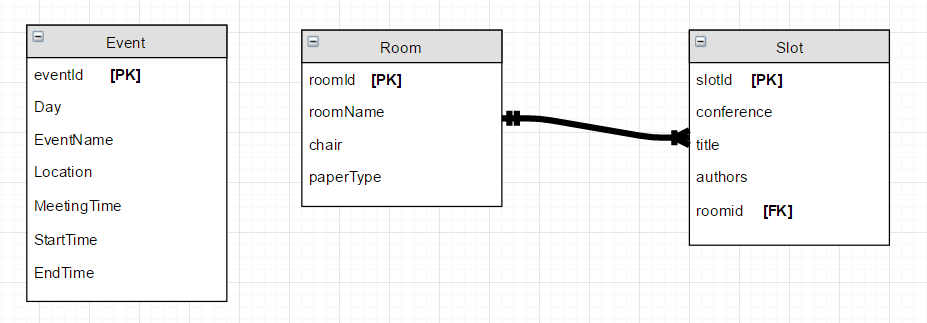

# Git guide:

	- In order to use git with the Windows operating system you need to download the git bash through https://git-scm.com/downloads. 
	- I recommend using HTTPS instead of SSH because with Windows you have to take some extra steps to work with SSH.
	With HTTPS however all you need to do is login and you are all set. You do not have to log in every time you push.
	- After installation use the command git clone https://github.com/wtcis-software-systems-development/iscap.git to clone the project.
	- Please do not push to the master and instead push to a branch with your team name.
	
	In order to push to a branch run the following commands:
	
	- git checkout -b <branch name here>
	- git branch (to make sure that you are in the branch you created.)
	- git add .
	- git commit -m "<message here>" 
	- git push origin <branch name here> 

	
	